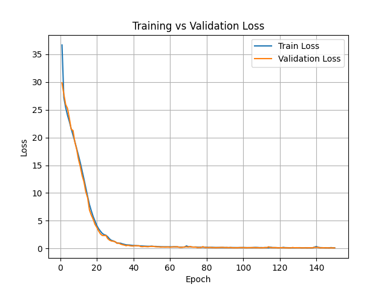
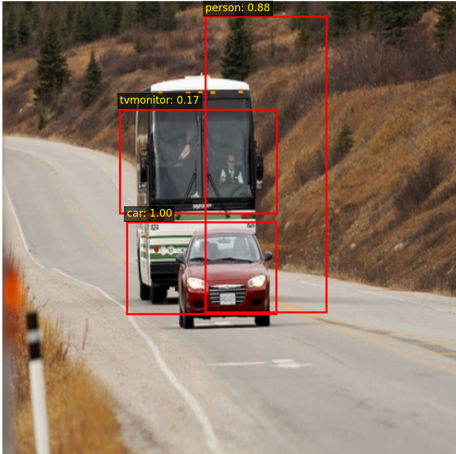

# YOLOv2 From Scratch (PyTorch)

This repository contains a full PyTorch implementation of YOLOv2 trained from random initialization (no pretrained backbone).

The goal of this experiment was to analyze the behavior of YOLOv2 when trained entirely from scratch and investigate convergence dynamics and detection performance.

---

## Experiment Setup

- Model: YOLOv2
- Backbone: Darknet (random initialization)
- Framework: PyTorch
- Training epochs: 150
- Anchors: K-means computed with IoU distance
- Loss: Standard YOLOv2 loss formulation
- Evaluation metric: mAP@0.50

---

## Results

- Training Loss: ~0.1
- Validation Loss: ~0.1
- mAP@0.50: 0.04

Although both training and validation loss converged smoothly toward zero, detection performance remained extremely low.

---

## Loss Curve

The loss decreases steadily and converges. However, this convergence does not translate into detection performance.

---

## Sample Prediction

The model produces very few valid detections, indicating severe objectness collapse.

---

## Failure Analysis

This experiment highlights a known issue in object detection training:

1. Severe class imbalance between object and background cells.
2. Dominance of the no-object loss term.
3. Collapse of objectness predictions toward zero.
4. Convergence to a trivial solution: predicting background everywhere.

Because most grid cells contain no object, the model minimizes total loss by suppressing objectness confidence across all predictions.

As a result:
- Total loss becomes very small.
- Recall approaches zero.
- mAP collapses.

This demonstrates that minimizing YOLO loss does not guarantee meaningful detection performance.

---

## Key Insights

- Monitoring loss alone is insufficient in object detection.
- mAP must be tracked throughout training.
- Pretrained backbones significantly stabilize early feature learning.
- Loss balancing (especially the no-object term) is critical.
- Detection models can converge to trivial minima if not carefully initialized.

---

## Conclusion

Training YOLOv2 entirely from scratch resulted in near-zero loss but only 4% mAP@0.50 due to objectness collapse caused by extreme background imbalance.

This experiment serves as a case study demonstrating the gap between optimization convergence and detection quality in one-stage detectors.

---